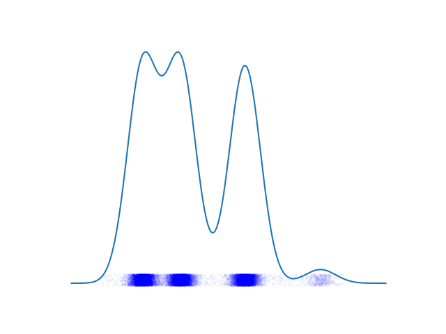
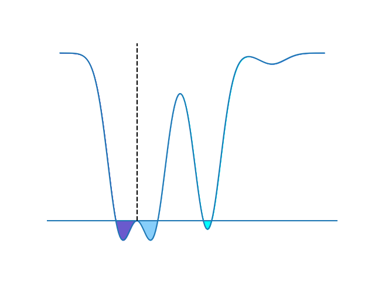
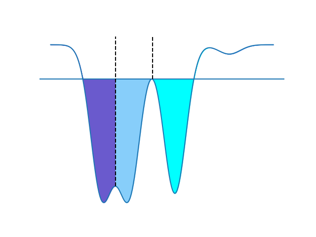
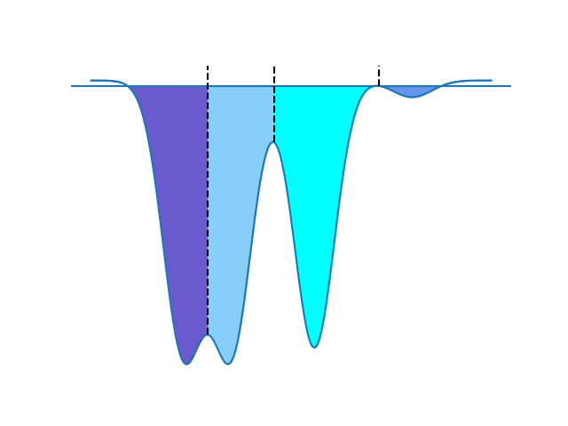
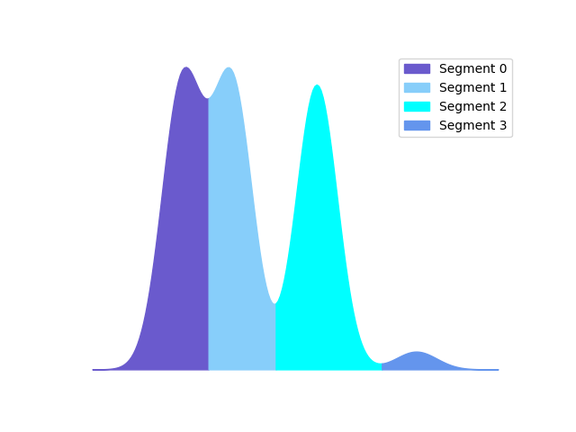
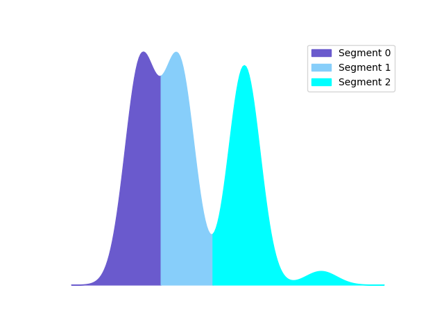
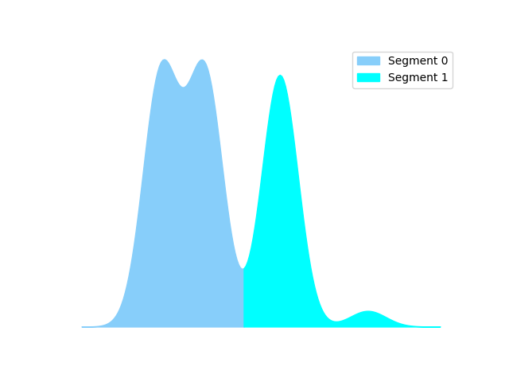

.. _segmentation_explained:

A Guide to Segmentation
=======================

This section offers a simple guide to flow cytometry segmentation and an explaination for the techniques used.

Big Picture
================
The goal of the segmentation process is to locate and isolate what a human expert considers a gate.
The first step a human expert carries out is to compute a per-channel histogram for each sample and identify prominent regions of interest (mountains) with comparatively large gaps between them and ignore regions with spurious gaps or few \“bins\”.
Lines are then drawn by the expert to demarcate the locations of gates to prevent spillover from one region to another and thus preserve biologically relevant information such as ratios between subpopulations.
To replicate this procedure, we employ a three-step approach:

    1. Probability Density Function Estimation.
    2. Watershed Segmentation.
    3. Non-maximum Suppression.

Similar to watershed segmentation for images, the idea of this approach is based on estimating the probability density function (pdf) and interpret it as a 2D topographical map with one spatial coordinate versus density, which corresponds to 1D mountains and valleys.
\"In such a “topographic” interpretation, we consider three types of points: (1) points belonging to a regional minimum; (2) points at which a drop of water, if placed at the location of any of those points, would fall with certainty to a single minimum; and (3) points at which water would be equally likely to fall to more than one such minimum.
For a particular regional minimum, the set of points satisfying condition (2) is called the catchment basin or watershed of that minimum. The points satisfying condition (3) form crest lines on the topographic surface, and are referred to as divide lines or watershed lines.
The principal objective of segmentation algorithms based on these concepts is to find the watershed lines. \" (Gonzalez, Rafael C, and Richard E. Woods. Digital Image Processing.)

Steps
==========
We construct a sample z as a mixture distribution with shifted normal components.
Given $z_0~N(0,0.3)$, $z_1=z_0$, $z_2=z_0+1.7$,$z_3=z_0+4.6$ ,and $z_4=z_0+8$, we get ${z_1,…,z_4 }∼{P_1 (x),…,P_4 (x)}$ and mixing wights w_i = 0.32  for i ∈{1,2,3}  and 0.04 for i=4.
We end up with the final $ z ∼ f(x) = \[\sum_{i=1}^{4} w_i P_i (x) \]$

First, we compute the pdf for each channel in each sample using Kernel Density Estimation (KDE) as shown in figure(1).
Second, we “flip” the pdf by multiplying it with -1 and apply Watershed segmentation algorithm.
Flipping the pdf converts mountains to catchment basins for the Watershed algorithm.

The algorithm starts from a collection of chosen seeds (typically all local minima) with each seed having a different label.
These seeds indicate where the flooding starts. It is worth mentioning that although these seeds have distinct labels, they might end up merged if they do not surpass defined thresholds.

This procedure typically produces an over-segmented pdf. Thus, the third step is to “suppress” spurious segments based on three morphological characteristics that define what a proper segment is, namely, how many cells are there in a gate, and how wide and deep the valley between two consecutive gates is. If a segment does not satisfy these criteria, it is suppressed and assigned to its nearest segment as shown in

