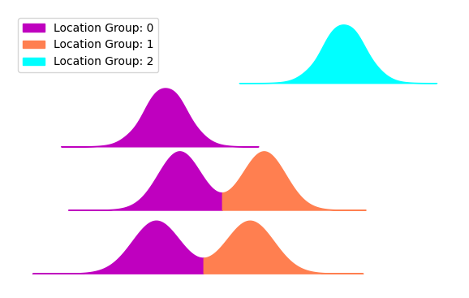

.. _problem_statement:

Problem Statement
======================================

This section offers a formal introduction to the alignment task.

Given a dataset $D={X_0,X_1,…,X_n}$ where $n$ is the number of samples and $X_i$ is an $R^{c×m_i}$ matrix where $m_i$  is the number of cells present in sample $X_i$ and $c$ is the number of channels.
A channel $j$ data $C_j$  is a subset of $D$ such that $C_j= {x_{0,j},x_{1,j},…,x_{n,j}} $ where $x_{i,j}$ is an $R^{m_i}$ vector that represents the $i^{th}$ sample $j^{th}$ channel data.
We can treat the values of each $x_{i,j}$ as $m_i$ observed (realized) random variables sampled from an unknown marginal distribution with probability density function (pdf) $f_{i,j}(x)$. Furthermore, we can model $f_{i,j} (x)$ as a mixture model $f_{i,j}(x) = \sum_{k∈K_{i,j}} w_{i,j,k } P_{i,j,k} (x)$ such that for each mixing weight, $w_{i,j,k }> 0, \sum_{k∈K_{i,j}}w_{i,j,k }=1, P_{i,j,k} (x)$ is a pdf and $K_{i,j}$⊆ $K_j$ where $K_j$ is the set of indices corresponding to location groups present in the jth channel.
e define a location group as a special categorization of samples segments based on segments proximity to one another. For concreteness, consider the example shown in figure().

Given a channel data $C_0$ containing 4 samples numbered 0 to 3 from the top, we observe 3 distinct location groups. Thus, $K_0=\{0,1,2\}, K_{0,0}=\{2\},K_{0,1}=\{1\},K_{0,2}=\{0,1\}$ and $K_{0,3}=\{0,1\}$.
The goal of an alignment method is to, first, identify the segments of each sample, second, categorize these segments into groups, third, choose a set of references that satisfy certain constraint and desiderata, and fourth, align each sample to these references accordingly.

More formally, given a channel data $C_j=\{x_{0,j},x_{1,j},…,x_{n,j} \}$ such that $x_{i,j}  ∼ f_{i,j} (x)= \sum_{k∈K_{i,j}} w_{i,j,k } P_{i,j,k} (x)$, the goal of an alignment method after finding $K_j,K_{i,j},w_{i,j,k }$ and $P_{i,j,k} (x)$ is divided into two steps; First, we find a set of references $R_j=\{RP_{j,0} (x),RP_{j,1} (x),…,RP_{j,g} (x)\}$ where $RP_{j,k} (x)$ is a reference probability density function for the $k^th$ location group and $g$ is the number of location groups in $K_j$. Furthermore, $R_j$ must satisfy certain desiderata that are discussed in :ref:`the grouping and ranking guide <grouping_explained>`. Second, we find a set of mappings $ϕ_j= \{ϕ_{0,j},  ϕ_{1,j}, … ,ϕ_{n,j}}$ where $ϕ_{i,j }$ is the mapping for ith sample such that:

$$x_{i,j}  ∼f_{i,j} (x) \sum_{k∈K_{i,j}} w_{i,j,k } P_{i,j,k} (x)$$. $$ϕ_{i,j} (x_{i,j})  ∼f_{i,j} (x) \sum_{k∈K_{i,j}} w_{i,j,k } RP_{j,k} (x)$$.

We notice that each $P_{i,j,k} (x)$ is mapped to $RP_{j,k} (x)$ while the mixing weights $w_{i,j,k }$ remain unchanged. This is done in order to preserve original ratios between subpopulations. An additional criterion is having $ϕ_{i,j}$ to be homeomorphic on the support of  $x_{i,j }$. This is to ensure that the transformation is continuous, smooth and.